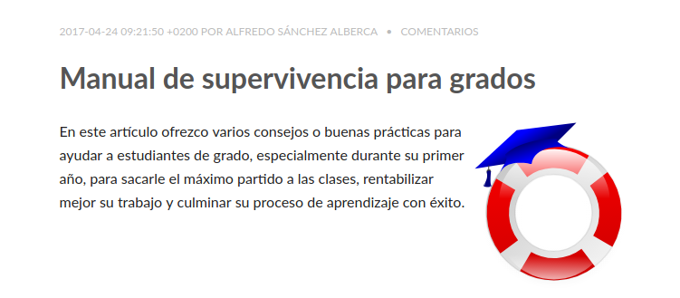
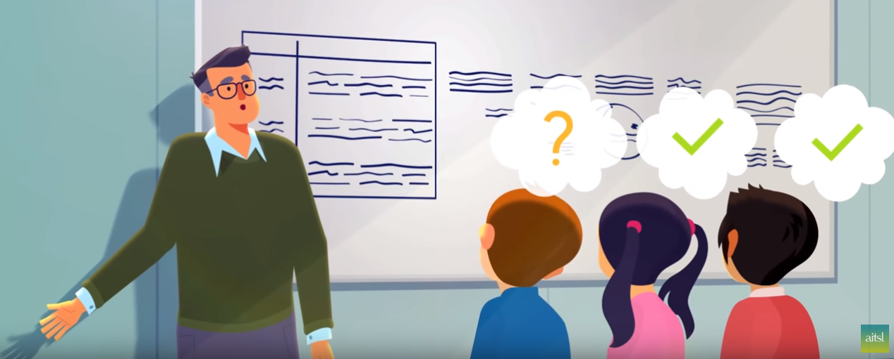
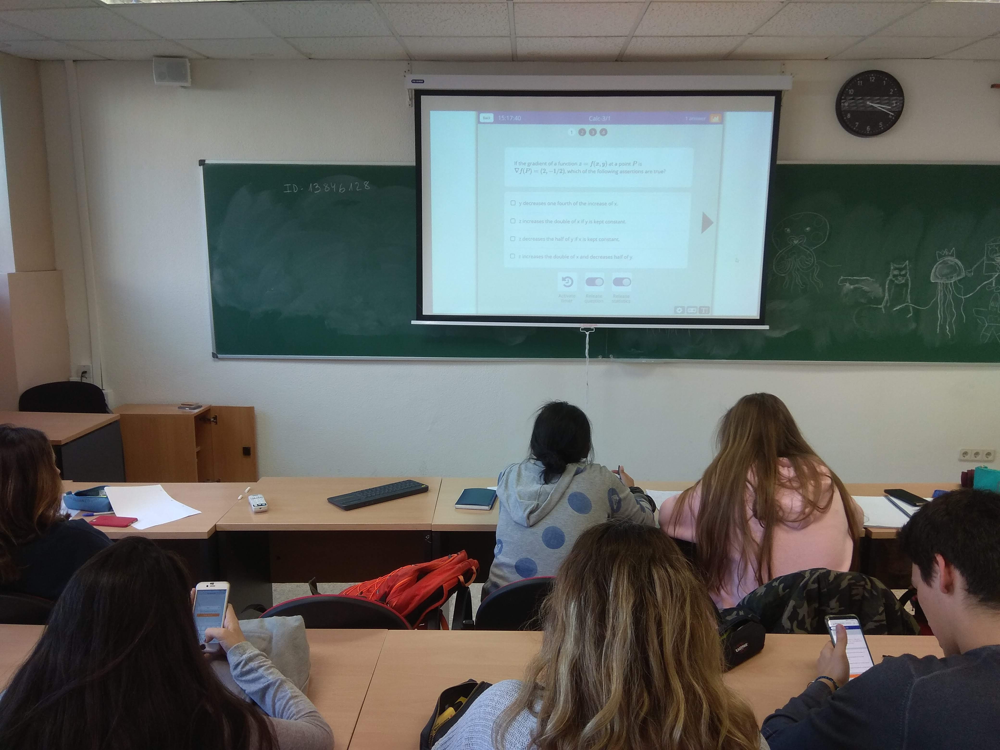
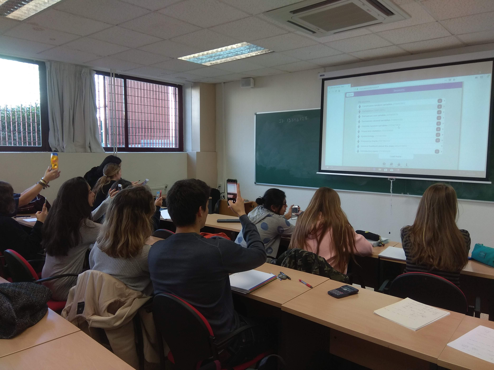
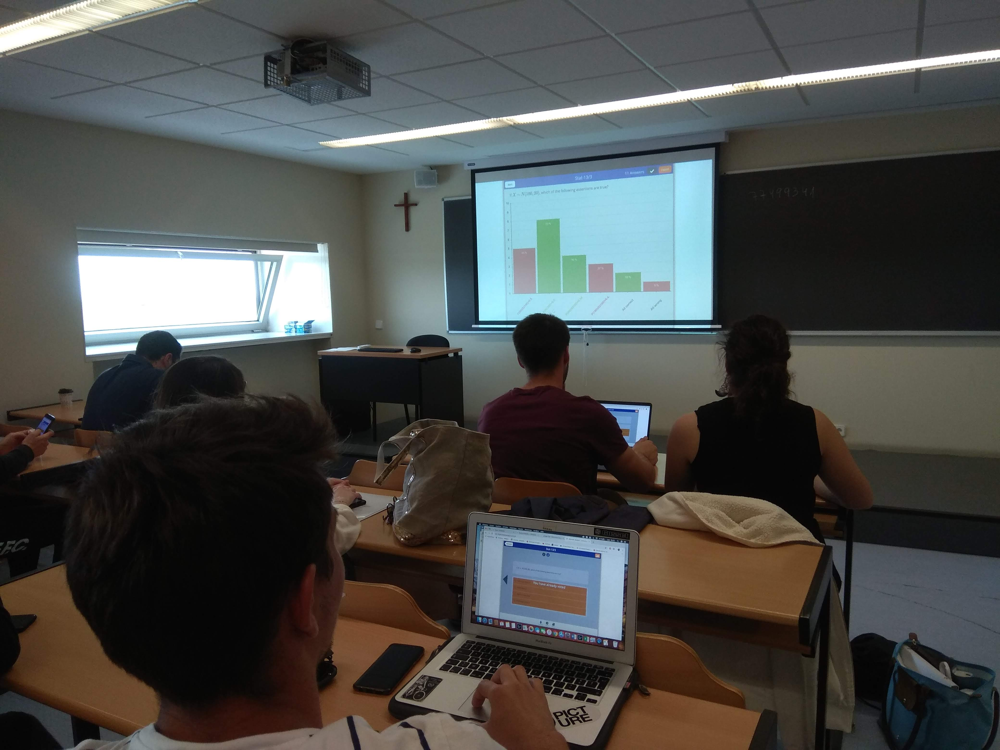
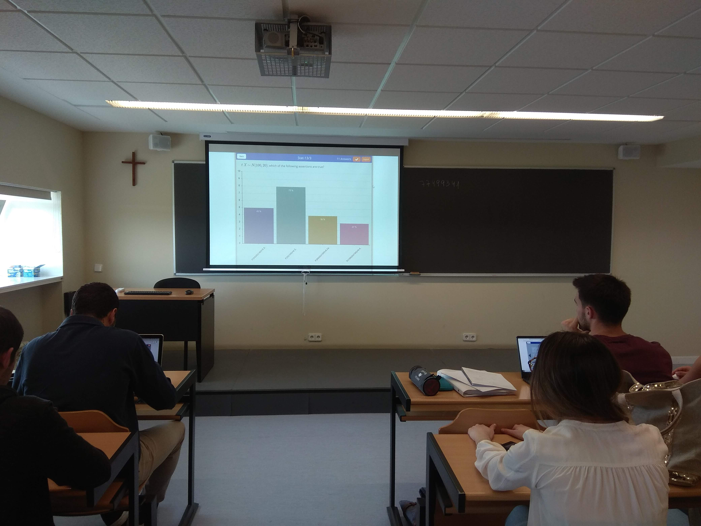

<link rel="stylesheet" href="https://use.fontawesome.com/releases/v5.7.2/css/all.css" integrity="sha384-fnmOCqbTlWIlj8LyTjo7mOUStjsKC4pOpQbqyi7RrhN7udi9RwhKkMHpvLbHG9Sr" crossorigin="anonymous">

# Nuevas tecnologías para fomentar la retroalimentación en el aula

Autor: Alfredo Sánchez Alberca ([asalber@ceu.es](mailto:asalber@ceu.es))  
http://aprendeconalf.es  

---

## Seguir la presentación en linea

http://aprendeconalf.es/arsnova/

---

## Manual de supervivencia para grados

---

## Necesidad de retroalimentación

La retroalimentación es esencial para asegurar un progreso sólido en cualquier proceso de aprendizaje.

--

## Retroalimentación efectiva

- Exhaustiva
  - Contenidos
  - Alumnos
- Frecuente
- Evaluable
- Medible
- Breve

_¿Cómo vencer el la timidez, la vergüenza, el miedo, la apatía o la falta de colaboración para conseguir una **retroalimentación efectiva**?_

--

## Retroalimentación a través de cuestionarios de evaluación

- En el aula.
- En cada clase (al final de la clase o al comienzo de la siguiente).
- 4 o 5 preguntas sobre los principales conceptos trabajados en clase.
- No más de 5 o 10 minutos.
- Evaluación in situ.

Suena bien, _¿pero cómo?_

---

--

## ARSnova (Audience Response System)

- Acceso por medio de dispositivos móviles (teléfonos, tabletas, ordenadores, ...)
- No necesita instalación (acceso vía web)
- No necesita registro (anónimo)
- No necesita configuración
- Fácil de usar

--

## Ventajas frente a los competidores

### (kahoot, wooclap, quizshow.io, etc )

- Reconoce el lenguaje de formateo markdown.
- Reconoce código LaTeX para la escritura de Matemáticas.
- API para la carga de cuestionarios desde otras aplicaciones.
  - Uso de R u otras aplicaciones para la generación automática de preguntas.
- Código abierto

---

## Demostración
## http://arsnova.eu

--

## Arsnova en acción
| | |
|:-:|:-:|
||
||

---

## Conclusiones

- ARSnova es una sencilla herramienta para interactuar con el usuario de manera anónima y conseguir una retroalimentación efectiva.
- Se ha utilizado esta herramienta de manera experimental en los dos últimos cursos con buenos resultados:
  - Valoración positiva de los alumnos
  - Menor absentismo a clase

---

<section data-background-video="img/porky.mp4">

